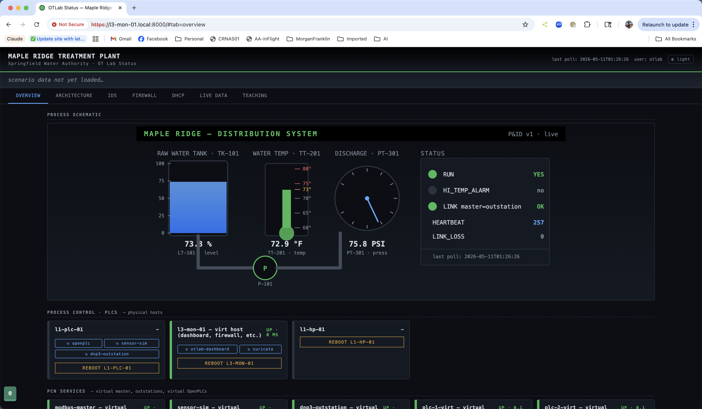

# OTLab — ICS Training Lab on a Single Raspberry Pi



Hands-on industrial control systems training lab built for [ICS Village](https://icsvillage.com/) (DEF CON village). Runs the entire DMZ + Process Control fabric — firewall, DHCP, DNS, virtual PLCs, Modbus + DNP3 outstations, master polling loop, Suricata IDS, and an operator dashboard — as containers on **one Raspberry Pi**.

```
                          ┌─────── operator browser ──────┐
                          │                                │
                          ▼                                │
   ┌───────────── single Raspberry Pi 5 ──────────────────┐│
   │                                                       ││
   │   ┌── DMZ · dmz-br0 · 192.168.75.0/24 (L3.5) ─────┐ ││
   │   │   firewall · dhcp-dmz · OTLab Dashboard       │ ││  ←─ https://<pi>:8000/
   │   └───────────────┬─────────────────────────────────┘ ││
   │                   │ firewall conduit (iptables)        ││
   │   ┌── PCN · pcn-br0 · 10.20.30.0/24 (L1/L2) ─────┐  ││
   │   │   firewall · dhcp-pcn · modbus-master         │  ││
   │   │   sensor-sim · dnp3-outstation                │  ││
   │   │   plc-1-virt · plc-2-virt (OpenPLC)           │  ││
   │   └─────────────────────────────────────────────────┘  ││
   │                                                          ││
   │   + Suricata IDS sniffing pcn-br0                       ││
   │   + Cockpit / Portainer / EdgeShark admin UIs            ││
   └──────────────────────────────────────────────────────────┘│
                          │                                    │
                          └── wlan0 → internet ────────────────┘
```

**One Pi. One wlan for internet. That's it.** Everything else lives in containers.

> **Status:** Standalone single-Pi lab is shipped and working. Optional physical expansion (additional Pis with real GPIO + real Conpot honeypot fabric) is documented separately. Curriculum + Attack/Detect/Defend exercises + CTF challenges are the next chunk of work — **looking for contributors here** (see [CONTRIBUTING.md](CONTRIBUTING.md)).

## What you get

A complete teaching environment for ICS / OT security, all on one Pi:

| Category | What |
|---|---|
| **Network segmentation** | Industrial DMZ (L3.5) + Process Control Network (L1/L2), enforced by a containerized iptables firewall with SNAT + DNS forwarding |
| **DHCP / DNS** | Per-zone dnsmasq DHCP with static reservations · DNS forwarder integrated into the firewall · all queries logged for "DNS exfil at the firewall" teaching |
| **Master / outstation loop** | `modbus-master` container polling `sensor-sim` at 10 Hz — deterministic, observable Modbus TCP traffic on the wire |
| **OpenPLC** | Two virtual OpenPLC instances with web UIs (port `:8081`, `:8082`) for IEC 61131-3 click-around lessons |
| **DNP3** | Pure-stdlib DNP3 outstation on `:20000` |
| **IDS** | Suricata sniffing `pcn-br0` with OTLAB rules for Modbus FC5/6/15/16 writes from non-master IPs + SSH brute-force detection |
| **Dashboard** | 7-tab Flask + vanilla JS operator surface: Overview · Architecture · IDS · Firewall · DHCP · Live Data · Teaching |
| **Admin UIs** | Cockpit (Linux), Portainer (Docker), EdgeShark (live packet capture in browser) |

## Quickstart — single Pi from scratch

You need: **one Raspberry Pi 5 (16 GB recommended, 8 GB works)** with WiFi (for internet), an SD card or NVMe, and operator workstation (macOS or Linux laptop) on the same network.

```bash
# === 1. Image a fresh Pi OS Lite (64-bit Bookworm) on the SD/NVMe ===
# In Pi Imager → Advanced: set hostname `l3-mon-01`, configure WiFi,
# enable SSH, set username + password.

# === 2. From your operator workstation, clone this repo ===
git clone https://github.com/aaroncorvo/otlab.git
cd otlab

# === 3. Push ssh keys to the freshly-imaged Pi ===
ssh-copy-id <imager-user>@l3-mon-01.local

# === 4. Bootstrap (creates otadmin + otuser, installs Docker, lab venv) ===
./scripts/bootstrap-users.sh    <imager-user>@l3-mon-01.local
./scripts/bootstrap-pi.sh        otadmin@l3-mon-01.local
./scripts/bootstrap-l3-mon-role.sh otadmin@l3-mon-01.local

# === 5. Deploy the lab fabric ===
./scripts/install-virtual-lab.sh otadmin@l3-mon-01.local

# === 6. Add Suricata IDS + admin UIs (optional but recommended) ===
./scripts/install-suricata.sh    otadmin@l3-mon-01.local
./scripts/install-cockpit.sh     otadmin@l3-mon-01.local
./scripts/install-portainer.sh   otadmin@l3-mon-01.local
./scripts/install-edgeshark.sh   otadmin@l3-mon-01.local
```

Total time: **~30 min** on the first run (most of which is the OpenPLC source build — cached on re-runs).

After deploy, browse to:

| URL | What | Login |
|---|---|---|
| `https://l3-mon-01:8000/` | **OTLab Dashboard** (the main thing) | `otlab` / `P@ssw0rd!` |
| `https://l3-mon-01:9090/` | Cockpit (Linux admin) | `otadmin` / your sudo password |
| `https://l3-mon-01:9443/` | Portainer CE (Docker UI) | set on first visit |
| `http://l3-mon-01:5001/`  | EdgeShark (live pcap in browser) | none |
| `http://l3-mon-01:8081/`  | Virtual OpenPLC #1 web UI | `openplc` / `P@ssw0rd!` |
| `http://l3-mon-01:8082/`  | Virtual OpenPLC #2 web UI | same |

> Lab convention: intentionally-public passwords for booth use. **Rotate per event** so creds don't leak between cohorts.

Full step-by-step walkthrough: **[`docs/setup-from-scratch.md`](docs/setup-from-scratch.md)**.

## What the dashboard shows


*30-second demo: fire a Modbus FC6 write from the Teaching tab → see it land as an OTLAB-1004 alert on the IDS tab → see the firewall counter tick on the Firewall tab. (If the GIF above is missing, see [`reference/screenshots/`](reference/screenshots/) for the capture playbook.)*

Seven tabs — full walkthrough in **[`docs/dashboard-tour.md`](docs/dashboard-tour.md)**:

| Tab | What | Screenshot |
|---|---|---|
| **Overview** | Live process state (animated SVG synoptic) + cards for every container + live Modbus poll telemetry from the master | [`overview.png`](reference/screenshots/overview.png) |
| **Architecture** | Purdue model with the lab's actual assets placed at their canonical levels + auto-discovered network topology | [`architecture.png`](reference/screenshots/architecture.png) |
| **IDS** | Suricata stats — counts (5m / 1h / 24h), 24h timeline, top signatures, top sources, top targets, recent alerts | [`ids.png`](reference/screenshots/ids.png) |
| **Firewall** | Live iptables (5 chains) with packet counters · conntrack snapshot · DNS query stats + log | [`firewall.png`](reference/screenshots/firewall.png) |
| **DHCP** | Per-zone (DMZ + PCN) lease tables + static reservations + recent transactions | [`dhcp.png`](reference/screenshots/dhcp.png) |
| **Live Data** | System health, audit log, pcap captures | [`live-data.png`](reference/screenshots/live-data.png) |
| **Teaching** | Risks, walkthroughs, runnable test library, Modbus Write Playground, Inject Fault, Cohort Reset | [`teaching.png`](reference/screenshots/teaching.png) |

## Expanding the lab

Once the single-Pi setup is working, you can extend it for richer teaching scenarios:

| Expansion | What it adds | Doc |
|---|---|---|
| **Add a physical OpenPLC Pi** | Real GPIO, real Modbus on the wire, Phase 2 hardware (relays, indicators, pushbutton) | [`setup-from-scratch.md` § Stage 2](docs/setup-from-scratch.md) |
| **Add a physical Conpot Pi** | Three vendor honeypot personas (Siemens / Schneider / Rockwell) on a separate physical box | [`setup-from-scratch.md` § Stage 2](docs/setup-from-scratch.md) |
| **Add an RS485 Modbus device** | Connect a real industrial sensor (temp, energy meter, etc.) via a Waveshare RS485-to-Ethernet gateway | [`setup-from-scratch.md` § Stage 3](docs/setup-from-scratch.md) |
| **Add wireless IoT** | ESP32 Modbus client over WiFi joining the PCN segment | [`setup-from-scratch.md` § Stage 4](docs/setup-from-scratch.md) |

Each stage is **independent and optional**. The single-Pi lab is fully functional on its own — you don't need any of these expansions to teach the core curriculum.

## Repo layout

```
.
├── README.md                          ← you are here
├── docs/                               # Architecture + setup + curriculum
│   ├── setup-from-scratch.md          ← linear from-zero playbook (start here)
│   ├── dashboard-tour.md              ← 7-tab dashboard walkthrough
│   ├── lab-architecture.md            ← deep-dive build doc
│   ├── virtualization.md              ← ContainerLab fabric architecture
│   ├── naming-schema.md               ← canonical names, IPs, MAC reservations
│   ├── network-topology.md            ← physical NIC ↔ virtual fabric
│   ├── architecture-evolution.md      ← phase plan + decision log
│   ├── curriculum.md                  ← lessons, MITRE ATT&CK coverage
│   ├── phase-1-modbus-loop.md         ← first lesson walkthrough
│   └── arduino-setup.md               ← Arduino UNO breakout boards
├── virtual/                            # ContainerLab fabric
│   ├── topologies/otlab.clab.yaml     # full topology (9 nodes + 2 bridges)
│   └── dockerfiles/                   # 7 OTLab images
├── dashboard/                          # Dashboard source (mounted into container)
├── plc/                                # Python services + OpenPLC programs + scenarios
├── honeypot/                           # Conpot persona configs (optional Pi #3)
├── scripts/                            # Bootstrap + install scripts
└── reference/                          # Diagrams, BOMs, vendor OIDs, pcaps
```

## Operating the lab

```sh
# Topology state
ssh otadmin@l3-mon-01.local 'sudo containerlab inspect -t /home/otuser/lab/virtual/topologies/otlab.clab.yaml --format table'

# Tail a container's log
ssh otadmin@l3-mon-01.local 'sudo docker logs -f clab-otlab-modbus-master'

# Live firewall counters
ssh otadmin@l3-mon-01.local 'sudo docker exec clab-otlab-fw-dmz-pcn iptables -nvL FORWARD'

# Recent IDS alerts
ssh otadmin@l3-mon-01.local 'sudo grep "event_type\":\"alert" /var/log/suricata/eve.json | tail -10'

# Reset between cohorts (browser): Teaching tab → Reset Lab for Next Cohort

# Disaster recovery — nuke + redeploy
./scripts/install-virtual-lab.sh otadmin@l3-mon-01.local
```

## Contributing

This lab is intentionally public so people can learn from it, fork it, and improve it. See [CONTRIBUTING.md](CONTRIBUTING.md) for areas where help is welcome.

**Currently looking for**:
- **Curriculum + exercises** — Attack/Detect/Defend scenarios mapped to MITRE ATT&CK for ICS, written as runnable scripts in the Teaching tab's Test Library
- **CTF challenges** — flag-based exercises across the existing protocols (Modbus, DNP3, DNS, IDS rules)
- **Additional Conpot personas** — there's a Conpot Docker image; we could ship virtual personas alongside the physical ones so single-Pi users see honeypot data too
- **Live Modbus wire feed** — a sidecar sniffer container on pcn-br0 streaming decoded frames to the dashboard (currently the wire-feed panel gracefully degrades to a "no traffic visible" message)
- **Take-home topologies** — minimal ContainerLab YAML that runs on a student laptop (no Pi needed)
- **Documentation** — tutorials, video walkthroughs, blog posts

## License

[MIT](LICENSE). Use it, fork it, teach with it. Attribution appreciated but not required.

## Built for

[ICS Village](https://icsvillage.com/) at DEF CON. Big thanks to the ICS Village community for the multi-year container of curiosity and the encouragement to share this stuff publicly.
