# OTLab — Network, Assets & Architecture

Team-review document. Sole purpose: a single page that captures the
network plan, the asset inventory, and the architecture so docs can be
brought into alignment.

> **Audience**: anyone updating OTLab documentation, slides, or training
> materials. Not a build doc — see [`setup-from-scratch.md`](setup-from-scratch.md)
> for that.

---

## ⚠️ Important: this doc is the source of truth, not the future-state diagram

A future-state architecture diagram exists (RPI CM5 / VyOS / Authentik /
etc.). It captures the **shape** of where we're going. But the diagram
uses a *different IP plan than the running lab*, and re-IP'ing would
invalidate ~30 commits of working artifacts, screenshots, Suricata
rules, and DHCP reservations.

**Rule for any conflict between the diagram and this doc: this doc wins.**
We keep what we built. The diagram is "architectural intent at a
shape level," not "addresses to copy."

### Diagram → reality crosswalk

| Diagram says | What we actually use |
|---|---|
| L2 Industrial PCN: `192.168.64.0/24` | **PCN: `10.20.30.0/24`** |
| L3 Industrial DMZ: `172.16.64.0/24` | **DMZ: `192.168.75.0/24`** |
| L4 Enterprise: `10.0.64.0/24` | **Enterprise: `192.168.50.0/24`** *(new in V4.1)* |
| `mgmt` interface at `10.0.0.100` | Host mgmt via `wlan0` (operator wifi, varies) + tailscale |
| Cockpit at `10.0.0.100:443` | **Cockpit on host TCP `:9090`** (default port — host wlan0 IP varies) |
| EdgeShark at `10.0.0.100:5001` | **EdgeShark on host TCP `:5001`** ✓ port matches |
| OpenPLC at `192.168.10.15` | **`plc-1-virt` at `10.20.30.60`, `plc-2-virt` at `10.20.30.61`** |
| Codesys PLC at `192.168.10.10` | **`codesys-plc` at `10.20.30.80`** *(planned V4.4)* |
| ConPot honeypot at `192.168.10.100` | **`conpot-{siemens, schneider, rockwell}` at `10.20.30.50/.51/.52`** *(V4.0 virtualizes)* |
| Guacamole at `172.16.0.10` | **`guacamole` at `192.168.75.30`** *(planned V4.2)* |
| Authentik at `172.16.0.5` | **`authentik-server` at `192.168.75.10`** *(planned V4.2)* |
| VyOS MGMT `10.0.0.101` / Gateway `10.0.5.1` | **Firewall at `.1` on every zone** (192.168.75.1 / 10.20.30.1 / 192.168.50.1) |

The diagram's intent (zones, services, firewall conduit, Docker +
ContainerLab side-by-side) is correct and we're building toward it. The
IPs are not. Use the tables below for the real numbers.

---

## 1. Network zones

Three Purdue zones live on a single Raspberry Pi host (`l3-mon-01`).
Each zone is a Linux bridge inside the Pi's network namespace, with a
containerized firewall as the conduit between adjacent zones.

| Purdue level | Name | Subnet | Bridge | Status |
|---|---|---|---|---|
| **L4 Enterprise — Untrusted** | Enterprise | `192.168.50.0/24` | `ent-br0` | **planned (V4.1)** |
| **L3.5 Industrial DMZ** | Operations | `192.168.75.0/24` | `dmz-br0` | shipped |
| **L1/L2 Process Control** | Plant floor | `10.20.30.0/24` | `pcn-br0` | shipped |

**Out-of-band networks** (not enforced by lab firewall):

| Purpose | Subnet | Notes |
|---|---|---|
| Operator management | `192.168.120.0/24` | host wlan0; SSH + admin access; varies per operator wifi |
| Tailscale tailnet | `100.64.0.0/10` | `l3-mon-01` advertises both lab subnets to the tailnet |
| ContainerLab mgmt | `172.20.20.0/24` | internal clab control plane, not user-visible |

**DHCP scopes & gateways** (per zone):

| Zone | Gateway | DHCP server | Scope | DNS forwarder |
|---|---|---|---|---|
| Enterprise | `192.168.50.1` (firewall) | `192.168.50.2` (`dhcp-ent`) | `.100`–`.199` | `192.168.50.1` |
| DMZ | `192.168.75.1` (firewall) | `192.168.75.2` (`dhcp-dmz`) | `.150`–`.199` | `192.168.75.1` |
| PCN | `10.20.30.1` (firewall) | `10.20.30.2` (`dhcp-pcn`) | `.200`–`.250` | `10.20.30.1` |

The firewall container runs `dnsmasq` as a DNS forwarder bound to `.1` on every zone. All internal name resolution lands at the firewall, where every query is logged (DNS-exfil teaching artifact).

---

## 2. Asset inventory

Every asset in the lab — current and planned — in one master table.
Sorted by Purdue level (highest → lowest), then by IP within each zone.

| Asset | Purdue | Subnet | IP | Function | Role in the lab | Type | Status |
|---|---|---|---|---|---|---|---|
| `fw-ent-dmz` | L4 ↔ L3.5 | `192.168.50.0/24` | `.1` | Firewall | Conduit Enterprise ↔ DMZ; gateway for ENT zone; DNS forwarder for ENT | container | V4.1 planned |
| `dhcp-ent` | L4 | `192.168.50.0/24` | `.2` | DHCP server | Issues `.100`–`.199` leases for ad-hoc enterprise devices | container | V4.1 planned |
| `corp-ad` | L4 | `192.168.50.0/24` | `.10` | LDAP / Active Directory | Faux corp identity store; "external IdP" persona for SSO teaching | container | V4.1 planned |
| `corp-file` | L4 | `192.168.50.0/24` | `.20` | SMB file share | Faux corp file server; lateral-movement target | container | V4.1 planned |
| `operator-ws` | L4 | `192.168.50.0/24` | `.40` | Workstation persona | Simulates engineering laptop on the corp side; entry point for Guacamole demos | container | V4.1 planned |
| ENT DHCP pool | L4 | `192.168.50.0/24` | `.100`–`.199` | (dynamic) | DHCP scope for unknown enterprise devices | — | V4.1 planned |
| | | | | | | | |
| `fw-dmz-pcn` | L3.5 ↔ L1/2 | `192.168.75.0/24` | `.1` | Firewall + DNS | Conduit DMZ ↔ PCN; gateway for DMZ; DNS forwarder for DMZ; SNAT for DMZ→PCN | container | shipped |
| `dhcp-dmz` | L3.5 | `192.168.75.0/24` | `.2` | DHCP server | Issues `.150`–`.199` leases for operator devices in DMZ | container | shipped |
| `authentik-server` | L3.5 | `192.168.75.0/24` | `.10` | IdP / SSO front-end | Federated identity provider for DMZ services + jump server | container | V4.2 planned |
| `authentik-postgres` | L3.5 | `192.168.75.0/24` | `.11` | Postgres database | Backing store for Authentik (users, sessions, applications) | container | V4.2 planned |
| `authentik-redis` | L3.5 | `192.168.75.0/24` | `.12` | Redis cache | Authentik session + task queue cache | container | V4.2 planned |
| `ignition-scada` | L3.5 | `192.168.75.0/24` | `.20` | SCADA Gateway | Ignition Maker edition — HMI / historian / alarm pipeline | container | future |
| `guacamole` | L3.5 | `192.168.75.0/24` | `.30` | Jump server | Clientless RDP/SSH/VNC proxy from DMZ → PCN; "operators don't touch PLCs directly" pattern | container | V4.2 planned |
| `dashboard` | L3.5 | `192.168.75.0/24` | `.40` | Operator surface | OTLab Dashboard (7 tabs: Overview, Architecture, IDS, Firewall, DHCP, Live Data, Teaching) | container | shipped |
| DMZ DHCP pool | L3.5 | `192.168.75.0/24` | `.150`–`.199` | (dynamic) | DHCP scope for operator devices that need DMZ IPs | — | shipped |
| | | | | | | | |
| `fw-dmz-pcn` (PCN side) | L3.5 ↔ L1/2 | `10.20.30.0/24` | `.1` | Firewall + DNS | Same instance as DMZ side; gateway + DNS forwarder for PCN | container | shipped |
| `dhcp-pcn` | L1/L2 | `10.20.30.0/24` | `.2` | DHCP server | Issues `.200`–`.250` leases for PCN; honors static reservations for known MACs | container | shipped |
| `modbus-master` | L1/L2 | `10.20.30.0/24` | `.43` | Modbus TCP master | Polls `sensor-sim` @ 10 Hz (FC1/3/4 reads); generates the canonical "legitimate master" traffic pattern Suricata rules are tuned against | container | shipped |
| `l1-plc-01` | L1 | `10.20.30.0/24` | `.47` | Physical PLC host | Pi 5 running OpenPLC + Phase 2 GPIO (relays, AD16, LED strip, pushbutton); real Modbus on the wire | physical | shipped, opt-in (Stage 2) |
| `l1-hp-01` | L1 | `10.20.30.0/24` | `.48` | Physical honeypot host | Pi 3 B+ running Conpot fabric (alternative to virtualized Conpot in V4.0) | physical | shipped, opt-in (Stage 3) |
| `conpot-siemens` | L1 | `10.20.30.0/24` | `.50` | Honeypot persona (S7) | Siemens S7-200 PS4-CPU01 persona; speaks S7comm `:102` + HTTP `:80` | container | V4.0 planned (currently physical) |
| `conpot-schneider` | L1 | `10.20.30.0/24` | `.51` | Honeypot persona (Modbus) | Schneider M340 HVAC-M340 persona; speaks Modbus `:502` + HTTP `:80` | container | V4.0 planned (currently physical) |
| `conpot-rockwell` | L1 | `10.20.30.0/24` | `.52` | Honeypot persona (EthIP) | Allen-Bradley CompactLogix CHEM-LGX01 persona; speaks EtherNet/IP CIP `:44818` + HTTP `:80` | container | V4.0 planned (currently physical) |
| `waveshare-gw` | L1 | `10.20.30.0/24` | `.55` | Modbus RTU-to-TCP gateway | Bridges a physical RS485 sensor (temp / energy meter / etc.) onto Modbus TCP `:502` | physical | future, opt-in (Stage 4) |
| `plc-1-virt` | L1 | `10.20.30.0/24` | `.60` | Virtual PLC (open) | OpenPLC #1 — IEC 61131-3 runtime; web UI on host `:8081` | container | shipped |
| `plc-2-virt` | L1 | `10.20.30.0/24` | `.61` | Virtual PLC (open) | OpenPLC #2 — second instance for two-PLC scenarios; web UI on host `:8082` | container | shipped |
| `sensor-sim` | L1 | `10.20.30.0/24` | `.70` | Modbus TCP outstation | Water-treatment scenario: tank level, water temp, discharge pressure, heartbeat; HTTP ctrl on `:5021` for fault injection | container | shipped |
| `dnp3-outstation` | L1 | `10.20.30.0/24` | `.71` | DNP3 outstation | Pure-stdlib DNP3 server on `:20000`; same scenario as sensor-sim | container | shipped |
| `codesys-plc` | L1 | `10.20.30.0/24` | `.80` | Vendor PLC runtime | CODESYS Control SL — what Festo/Wago/ABB ship; OPC-UA server built in | container | V4.4 planned |
| `codesys-hmi` | L1 | `10.20.30.0/24` | `.81` | Vendor HMI | CODESYS Web HMI — vendor HMI surface for comparison vs OpenPLC | container | V4.4 planned |
| PCN DHCP pool | L1/L2 | `10.20.30.0/24` | `.200`–`.250` | (dynamic) | DHCP scope for ad-hoc PCN devices (test clients, demo IIoT, etc.) | — | shipped |

### Host services (run on the Pi directly, outside ContainerLab)

Reached via the host's `wlan0` IP (operator network — DHCP-assigned,
varies per network). No fixed lab IP because these aren't part of
the zone fabric.

| Service | Listen | Proto | Function | Role in the lab | Status |
|---|---|---|---|---|---|
| OTLab Dashboard | `192.168.75.40:8000` (DMZ) + host `:8000` (forward) | HTTPS | Web app | Operator surface — 7 tabs covering Overview / Architecture / IDS / Firewall / DHCP / Live Data / Teaching | shipped |
| Cockpit | host `:9090` | HTTPS | Linux server admin | System service / journal / network / terminal in the browser; useful when SSH isn't convenient | shipped |
| Portainer CE | host `:9443` | HTTPS | Docker UI | Container manager — live logs / exec shell / restart / inspect for every `clab-otlab-*` container | shipped |
| EdgeShark | host `:5001` | HTTP | Live packet capture | Topology-aware in-browser tcpdump for every netns + veth | shipped |
| Virtual OpenPLC #1 UI | host `:8081` | HTTP | PLC web UI | clab port-forward to `plc-1-virt:8080` — OpenPLC IDE + runtime control | shipped |
| Virtual OpenPLC #2 UI | host `:8082` | HTTP | PLC web UI | clab port-forward to `plc-2-virt:8080` | shipped |
| Suricata IDS | EVE JSON at `/var/log/suricata/eve.json` | — | Network IDS | Sniffs `pcn-br0` (and `ent-br0` post V4.1); OTLAB-NNNN rules fire on Modbus FC5/6/15/16 writes from non-master IPs | shipped |
| Tailscale | tailnet route advertiser | — | VPN / subnet router | Advertises `192.168.75.0/24`, `10.20.30.0/24` (+ `192.168.50.0/24` post V4.1) to the operator tailnet | shipped |

### Companion apps (separate audience, separate deployment)

These don't belong in the OTLab zone fabric — they run wherever the
classroom instructor / event ops team needs them, with their own
network reach. They live in this repo because the same training
context uses both.

| App | Listen | Proto | Function | Role | Status |
|---|---|---|---|---|---|
| Teacher Admin Panel | classroom-host `:8080` | HTTPS | Multi-Pi roster + classroom canvas + optional FortiGate port monitor | Lets a classroom instructor see all student Pis in one view, drag them onto a layout to match the physical room, lock the roster mid-class, and (optional) see which student is plugged into which FortiGate switch port | shipped — see [`teacher/README.md`](../teacher/README.md) |

> **Network map for the classroom layer**: this doc covers what's
> *inside* one student's Pi. For the cross-Pi picture (instructor laptop,
> classroom subnet, switch + DHCP recommendations, trust boundaries),
> see [`classroom-network.md`](classroom-network.md).

---

## 3. Architecture diagram (current-IP scheme)

GitHub renders the Mermaid diagram below inline. For visual editing or
PowerPoint export, open [`reference/diagrams/network-architecture.drawio`](../reference/diagrams/network-architecture.drawio)
in [app.diagrams.net](https://app.diagrams.net/) (web) or the drawio
desktop app.

```mermaid
flowchart TB
    classDef l4   fill:#fff4e6,stroke:#cc7a00,color:#000
    classDef dmz  fill:#e3f0ff,stroke:#1f6feb,color:#000
    classDef pcn  fill:#e6f7ec,stroke:#2c8a3f,color:#000
    classDef host fill:#f5f5f5,stroke:#666,color:#000,stroke-dasharray:4 3
    classDef fw   fill:#fde2e2,stroke:#c43a3a,color:#000

    inet([Internet / Operator wifi])

    subgraph L4["L4 Enterprise · ent-br0 · 192.168.50.0/24 — planned (V4.1)"]
        ent_fw[".1 fw-ent-dmz<br/>firewall + DNS"]:::fw
        ent_dhcp[".2 dhcp-ent"]:::l4
        corp_ad[".10 corp-ad<br/>faux AD/LDAP"]:::l4
        corp_file[".20 corp-file<br/>faux SMB"]:::l4
        op_ws[".40 operator-ws<br/>eng laptop"]:::l4
    end

    subgraph DMZ["L3.5 DMZ · dmz-br0 · 192.168.75.0/24"]
        dmz_fw[".1 fw-dmz-pcn<br/>firewall + DNS"]:::fw
        dmz_dhcp[".2 dhcp-dmz"]:::dmz
        authentik[".10–.12 authentik<br/>IdP/SSO · V4.2"]:::dmz
        ignition[".20 ignition-scada<br/>future"]:::dmz
        guacamole[".30 guacamole<br/>jump server · V4.2"]:::dmz
        dashboard[".40 dashboard<br/>operator surface"]:::dmz
    end

    subgraph PCN["L1/L2 PCN · pcn-br0 · 10.20.30.0/24"]
        pcn_fw[".1 fw-dmz-pcn<br/>firewall + DNS"]:::fw
        pcn_dhcp[".2 dhcp-pcn"]:::pcn
        mm[".43 modbus-master<br/>polls @ 10 Hz"]:::pcn
        l1_plc[".47 l1-plc-01<br/>physical · opt-in"]:::pcn
        l1_hp[".48 l1-hp-01<br/>physical · opt-in"]:::pcn
        conpot[".50–.52 conpot<br/>siemens/schneider/rockwell · V4.0"]:::pcn
        wave[".55 waveshare-gw<br/>RS485 · future"]:::pcn
        plc1[".60 plc-1-virt<br/>OpenPLC"]:::pcn
        plc2[".61 plc-2-virt<br/>OpenPLC"]:::pcn
        sensor[".70 sensor-sim"]:::pcn
        dnp3[".71 dnp3-outstation"]:::pcn
        codesys[".80/.81 codesys<br/>PLC + HMI · V4.4"]:::pcn
    end

    subgraph HOST["Host services (l3-mon-01 wlan0 / outside ContainerLab)"]
        cockpit["Cockpit :9090"]:::host
        portainer["Portainer :9443"]:::host
        edgeshark["EdgeShark :5001"]:::host
        suricata["Suricata IDS<br/>sniffs pcn-br0 (+ent-br0)"]:::host
        tailscale["Tailscale<br/>subnet router"]:::host
    end

    inet --> ent_fw
    ent_fw -.firewall conduit.-> dmz_fw
    dmz_fw -.firewall conduit.-> pcn_fw
    inet --> tailscale
```



For a literal-printable ASCII version:

```
                                Internet / Operator wifi
                                          │
                                          ▼
            ╔══════════════════════════════════════════════════════════╗
            ║          l3-mon-01  (Pi 5 16GB / future: CM5 carrier)    ║
            ║          ContainerLab fabric + host services             ║
            ║                                                           ║
   eth0 ───▶║   ┌── L4 Enterprise · ent-br0 · 192.168.50.0/24 ──┐     ║
            ║   │   .1  firewall (fw-ent-dmz)                    │     ║
            ║   │   .2  dhcp-ent                                  │     ║
            ║   │   .10 corp-ad        .20 corp-file               │     ║
            ║   │   .40 operator-ws                                │     ║
            ║   └────────────────┬─────────────────────────────────┘     ║
            ║                    │ firewall conduit                       ║
            ║   ┌── L3.5 DMZ · dmz-br0 · 192.168.75.0/24 ─────┐         ║
   eth1 ───▶║   │   .1  firewall (fw-dmz-pcn)                  │         ║
            ║   │   .2  dhcp-dmz                               │         ║
            ║   │   .10 authentik    .30 guacamole              │         ║
            ║   │   .40 dashboard                                │         ║
            ║   └────────────────┬───────────────────────────────┘         ║
            ║                    │ firewall conduit                       ║
            ║   ┌── L1/L2 PCN · pcn-br0 · 10.20.30.0/24 ─────┐           ║
   eth2 ───▶║   │   .1  firewall      .2  dhcp-pcn            │           ║
            ║   │   .43 modbus-master                          │           ║
            ║   │   .50 conpot-siemens   .51 -schneider .52 -rockwell │   ║
            ║   │   .60 plc-1-virt    .61 plc-2-virt           │           ║
            ║   │   .70 sensor-sim    .71 dnp3-outstation      │           ║
            ║   │   .80 codesys-plc   .81 codesys-hmi          │           ║
            ║   └──────────────────────────────────────────────┘           ║
            ║                                                              ║
            ║   Host services (outside ContainerLab):                      ║
            ║     ▸ Suricata IDS — sniffs ent-br0 + pcn-br0                ║
            ║     ▸ Cockpit (:9090)  Portainer (:9443)  EdgeShark (:5001)  ║
            ║     ▸ Tailscale — advertises 50.0/24 + 75.0/24 + 30.0/24     ║
            ║                                                              ║
            ║   wlan0 → operator wifi / internet uplink                    ║
            ╚══════════════════════════════════════════════════════════════╝

      Optional physical expansion (when eth1/eth2 USB-NIC are plugged):
            l1-plc-01 (.47) — physical Pi with OpenPLC + Phase 2 hardware
            l1-hp-01  (.48) — physical Pi running Conpot (alt. to virtual)
            waveshare-gw (.55) — RS485-to-Modbus-TCP gateway for real RTU
```

### Traffic flow rules (firewall policy)

| Source zone | Destination zone | Policy | Notes |
|---|---|---|---|
| Enterprise → DMZ | partial allow | `.50.40` (operator-ws) → `.75.30` (guacamole) only | Jump-server pattern |
| Enterprise → PCN | **deny** | — | Enterprise never touches PCN directly |
| DMZ → Enterprise | response only | ESTABLISHED, RELATED | |
| DMZ → PCN | port-allowlist | `22, 80, 502, 5020, 8080, 20000` (SSH, HTTP, Modbus, sensor-sim, OpenPLC UI, DNP3) | SNAT'd to `.30.1` |
| PCN → DMZ | response only | ESTABLISHED, RELATED | PLCs never initiate to DMZ |
| PCN → Enterprise | **deny** | — | |
| Any → WAN | NAT via wlan0 | MASQUERADE | Internet egress for apt + image pulls |
| WAN → any | **deny** | except ESTABLISHED | |

All DNS queries from any internal zone resolve through the firewall's `dnsmasq` forwarder. The firewall logs every query.

---

## 4. Network adjustments — what's changing

This is the delta from the current shipped lab to the target architecture:

| Change | What | Why |
|---|---|---|
| **+ New L4 Enterprise zone** | `ent-br0` on `192.168.50.0/24`, 3rd firewall interface | Completes the Purdue model. DMZ pattern needs an "outside" to be meaningful. |
| **+ Conpot personas as containers** | `.50/.51/.52` move from physical Pi → virtual containers (image: `honeynet/conpot`) | Single-Pi users get the honeypot fabric without buying a second Pi. Physical Pi expansion still supported. |
| **+ Authentik IdP** | 4 new DMZ containers at `.10/.11/.12` (+ worker) | Federated SSO across DMZ services |
| **+ Guacamole jump server** | 1 new DMZ container at `.30` | Browser-based RDP/SSH/VNC to PCN — the canonical "operators don't SSH directly to PLCs" pattern |
| **+ CODESYS Control SL** | New PCN containers at `.80/.81` | Vendor PLC runtime alongside the open-source OpenPLC |
| **~ Firewall topology** | Currently 1 container with 2 interfaces. Future: 1 container with 3 interfaces (V4.0–V4.2), optionally 2 VyOS containers (V4.3) | New ENT zone needs a 3rd firewall iface |
| **~ Suricata coverage** | Adds `ent-br0` to the sniff list | IDS watches the ENT↔DMZ boundary too |
| **~ Dashboard topology view** | Renders 3 zones instead of 2 | Reflects the new architecture |
| **= Subnets** | DMZ and PCN subnets stay at `.75/24` and `.30/24` | **No re-IP** of existing assets |
| **= Address plan** | All current container IPs unchanged | No reservation rewrite, no doc rewrite |
| **= Hardware** | Pi 5 + USB Ethernet still works; CM5 carrier with 3 onboard NICs is the future path | Software is hardware-agnostic; multi-NIC config already supported |

---

## 5. What docs need to be updated

If you're picking up this doc to do a documentation pass, here's the list:

| Doc | Update needed |
|---|---|
| [`README.md`](../README.md) | Add L4 Enterprise to the ASCII diagram once V4.1 ships |
| [`docs/setup-from-scratch.md`](setup-from-scratch.md) | Add a Stage for L4 Enterprise; mention virtual Conpot is default once V4.0 ships |
| [`docs/virtualization.md`](virtualization.md) | Update phasing table with V4.0–V4.4 status as each chunk lands |
| [`docs/naming-schema.md`](naming-schema.md) | Add ENT zone section, add Authentik/Guacamole/CODESYS rows |
| [`docs/network-topology.md`](network-topology.md) | Update for 3-NIC layout (eth0=ENT, eth1=DMZ, eth2=PCN) — currently 2-NIC |
| [`docs/lab-architecture.md`](lab-architecture.md) | Major refresh — extend Purdue model section to L4 |
| [`docs/dashboard-tour.md`](dashboard-tour.md) | New ENT row on Overview tab; Authentik tab if it gets one |
| [`docs/v4-roadmap.md`](v4-roadmap.md) | Status field per chunk as they land (V4.0 shipped, V4.1 in progress, etc.) |

This doc itself ([`docs/network-architecture.md`](network-architecture.md))
should be the **single source of truth** for the architecture picture
during the V4 transition. All other docs cite back to it; when this
doc changes, the others get updated to match.

---

## 6. Questions / decisions still open

For team to discuss before implementation kicks off:

1. **Cockpit on `:443` (diagram) vs `:9090` (current)?** Pros and cons in [`v4-roadmap.md`](v4-roadmap.md) decisions section. Leaning :9090.
2. **One firewall with 3 interfaces, or two firewalls (ENT↔DMZ + DMZ↔PCN)?** Diagram shows two. Simpler to ship one. Decision drives V4.1 topology shape.
3. **VyOS migration — V4.3 timeline?** iptables works today. VyOS is more authentic but riskier swap. Defer until V4.0–V4.2 are stable.
4. **CODESYS — go / no-go?** ARM64 image isn't trivial. May punt to V5 or use OpenPLC as a stand-in.
5. **Faux corp-AD / corp-file / operator-ws in L4 — how realistic?** FreeIPA + Samba give you real protocols. Or stubs that just respond on the right ports for visibility. Trade-off: realism vs memory footprint.

---

*Doc maintained by the OTLab core team. Last revised: this commit.
File a PR or issue if you spot a discrepancy with the running lab.*
